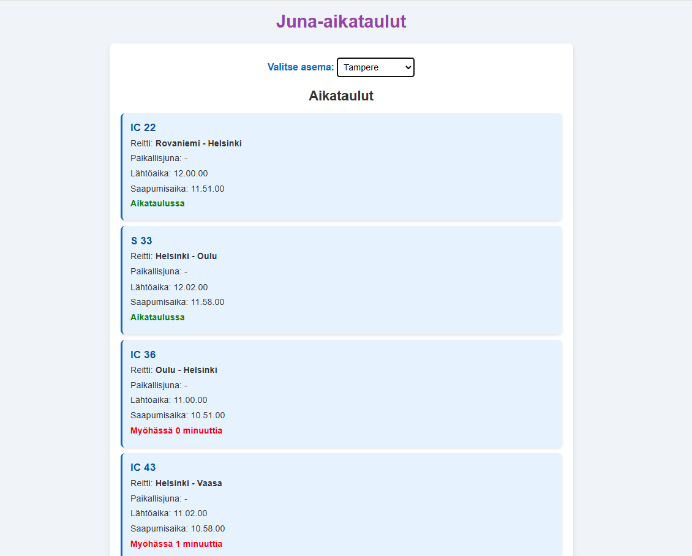

# Projektin nimi
Junien tiedot asemoittain by Kati

## Linkki sovellukseen:
Sovelluksen voi avata tästä linkistä: 
GitHub: [Junien tiedot asemoittain](https://cottiz.github.io/Asematiedot/)
Netlify: [Junien tiedot asemoittain](https://flourishing-cupcake-7eaf59.netlify.app/)

## Työntekeminen
Käytin projektiin aikaa n.27 tuntia. Työstin projektia itsenäisesti hyödyntäen osittain tekoälyä. 

## Sisällysluettelo:

- [Sovelluksen idea](#sovelluksen-idea)
- [Kuvakaappaukset](#kuvakaappaukset)
- [Teknologiat](#teknologiat)
- [Asennus ja käynnistys](#asennus-ja-käynnistys)
- [Toteutustapa](#toteutustapa)
- [Projektin tila](#projektin-tila)
- [Lähteet](#lähteet)
- [Lisenssi](#lisenssi)

## Sovelluksen idea
Junien tiedot asemoittain on sovellus, jossa käyttäjä voi valita pudotusvalikosta aseman ja tarkistaa, mitä junia kyseisellä asemalla on lähiaikoina pysähtymässä tai siitä mahdollisesti lähdössä. Sovellus käyttää Digitraffic API:a, joka tarjoaa reaaliaikaiset aikataulutiedot junista, niiden myöhästymisestä sekä saapumis- ja lähtöajoista. 

Halusin pitää aikataulutiedot yksinkertaisena, mutta laajentaa voisi vielä paljonkin. Asemia saisi sovellukseen todella paljon lisättyä, mutta halusin lähinnä keskittyä niihin suurimpiin. 

## Kuvakaappaukset
Tässä kuvakaappaus sovelluksesta: 

## Teknologiat
Projektissa käytin seuraavia teknologioita:
- HTML: sivuston rakenteen toteuttaminen
- CSS: sivuston ulkonäön toteuttaminen
- JavaScript: Tietojen hakuun API:sta ja niiden esittämiseen nettisivulla.
- Digitraffic API : Junien reaaliaikaisen aikatauludatan tarjoaja

## Toteutustapa
Sovelluksessa käytetään Digitraffic API:a tietojen hakuun valitun aseman perusteella. Pudotusvalikon kautta käyttäjä valitsee aseman ja sovellus näyttää valitun aseman junat reaaliajassa, myöhästymistilanteen sekä arvioidut lähtö- ja saapumisajat. 

Sovelluksen suunnittelu keskittyi selkeyteen ja käytettävyyteen. Pohdin mitkä ovat niitä tietoja, mitä itse haluaisin nähdä ja mistä hyötyisin. Tyylit toteutettiin yksinkertaisella CSS-määrityksillä.

## Asennus ja käynnistys
- lataa tai kloonaa repository
- avaa projektin kansiosta index.html selaimellasi
- suorita `npm install` komentoriviltä

## Projektin tila
[Junien tiedot asemoittain] on nyt valmis. Versio 2 on ideoinnin asteella, siihen voisi lisätä seuraavia: 
-Lisää asemia ja asemien lyhenteitä avattuna
-Mahdollisuus suodattaa junatyyppejä (ajanpuute versio 1)

## Lähteet
Projektissa käytetyt lähteet ja apuvälineet:
- ChatGPT ja Github Copilot: Käytin tekoälytyökaluja ongelmanratkaisussa ja koodin tarkistuksessa. 
- [Junat kartalla](https://www.vr.fi/junat-kartalla) - tarkistamiseen
- [Luettelo suomen rautatieliikennepaikoista](https://fi.wikipedia.org/wiki/Luettelo_Suomen_rautatieliikennepaikoista) - lyhenteiden tarkistamiseen

## Lisenssi
MIT lisenssi @ [Cottiz]